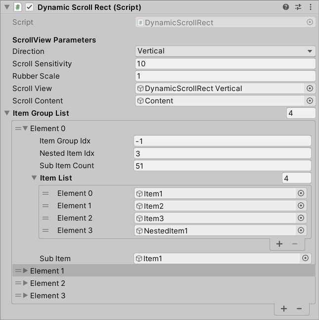

# Dynamic Scroll Rect

## Introduction

In many scenarios, there may exists a large numbers of elements in the `ScrollRect` (e.g. equipment inventory of a RPG game). Original `ScrollRect` implemented by Untiy builds all elements during gameplay, which costs a lot of time instantiating and drawing as well as memory for the elements that doesn't within the view port. 

@ivomarel's [InfinityScroll](https://github.com/ivomarel/InfinityScroll) and @qiankanglai's [LoopScrollRect](https://github.com/qiankanglai/LoopScrollRect) provide a solution by making the `ScrollRect` reusable. The basic idea of the solution is only build the elements that will be shown in the view port and dynamically add or remove elements during gameplay. In both *InfinityScroll* and *LoopScrollRect*, all elements are organized within the `LayoutGroup` that attached to the ScrollRect. 

In some cases however, elements might need to attach `LayoutGroup` as well. Take equipment inventory as an example, assume player has range weapon, melee weapon, and magic weapon. To put all weapons classified accroding to their type in the same scroll view, the best way is to put four elements into the `LayoutGroup` of ScrollRect, they will acts as the container of each type of weapons. Then put weapons into the `LayoutGroup` of their corresponding container elements. In this case, there are two layers of `LayoutGroup` structure.

**DynamicScrollRect** supports double layers of `LayoutGroup` structure with all the advantages of single layer `LayoutGroup` structure remains. If you need to construct a scroll view to display plenty of elements and need to classify these elements at the same time, this is absolutely what you need!

## Features

The original idea comes from @ivomarel's [InfinityScroll](https://github.com/ivomarel/InfinityScroll). After serveral refactorisations, I almost rewrite all the codes:

- Support double layers of `LayoutGroup` structure. 
- DynamicScrollRect manages elements in unit of `itemGroup`. User can flexablely arrange the layout of elements by configuring itemGroup.
- First layer only support `VerticalLayoutGroup` or `HorizontalLayoutGroup`, `GridLayoutGroup` is supported by second layer.
- Using object pool to improve performance when adding or removing elements.
- Support `ScrollBar`
- Support reloacation scroll view to specific itemGroup
- Reverse direction is not supported yet

## Example

Assume you are constructing a scroll view to display range weapon, melee weapon, magic weapon. For each weapon type, you want to have an element as a title to indicate the type of weapon for contents below and an element as a container to store single weapon elements.

In this case you will need three itemGroups, corresponding to three types of weapon. After that you need to provide two prefabs to the itemList of each itemGroup. One for the title element another for the containter element. Noted that the element container needs to attach `LayoutGroup` component. You also need to provide a prefab to the subItem of each itemGroup. It will act as the element that represent single weapon.

The arrangment of the layout of DynamicScrollRect is base on the order of itemGroups. You can alter the arrangement by change itemGroup order.

For more infromation and quick example implmentation, please refer to the DynamicScrolRect objects in the demo scene. 

## Instructions

Different from the Unity *ScrollView* in which the element layout is managed by *ScrollView* itself, *DynamicScrollRect* divides the whole content into groups and manages them by `ItemGroupConfig` classes. By specifying the layout and hierarchy of the elements in item groups, you can obtain your desire scroll view layout. Below are two ways to configurate item groups. 

+ ### Control with inspector
  You can configurate item groups ahead in the Unity inspector panel. After attaching the *DynamicScrollRect* as component of your object, *"Item Group List"* can be found in the *DynamicScrollRect* configuration panel. Each element in the *"Item Group List"* is an item group, you can configure the parameters of item group in its panel.

  - **Item Group Idx:** index of the item group in the item group list as well as the scroll view. This is an optional parameter, as program will automatically set its value during initialization.
  - **Nested Item Idx:** index of the item that contains subItems in this item group.
  - **SubItem Count:** number of subItem in this item group. If you don't need nested item structure in this item group, please set its value smaller than 1.
  - **Item List:** list of item prefabs of this item group. The order in the list determines the order of items display in the scroll view.
  - **SubItem:** prefab of subItem.

  Noted that the order in *'Item Group List'* will also determine the order of item groups display in the scroll view.
  
  

+ ### Control with scripts
  *DynamicScrollRect* provides several APIs by which you can manage the scroll view using scripts.
  To initialize or manage scroll view before it enter runtime, you can use:
  - **`AddItemGroupStatic()`**
  - **`AlterItemGroupStatic()`**
  - **`RemoveItemGroupStatic()`**
  - **`AddItemStatic()`**
  - **`RemoveItemStatic()`**
  - **`AddSubItemStatic()`**
  - **`RemoveSubItemStatic()`**
  
  To mange scroll view during runtime, you can use:
  - **`AddItemDynamic()`**
  - **`RemoveItemDynamic()`**
  - **`AddSubItemDynamic()`**
  - **`RemoveSubItemDynamic()`**
  
  For more infromation about these APIs, please refer to **\ulcorner APIs \lrcorner** section below.

## APIs

## Quick Jump

User can jump to the starting location of specific itemGroup by calling:

        public void ScrollToItemGroup(int itemGroupIdx)

Jumping to specific item or subItem in a itemGroup is still under development.

